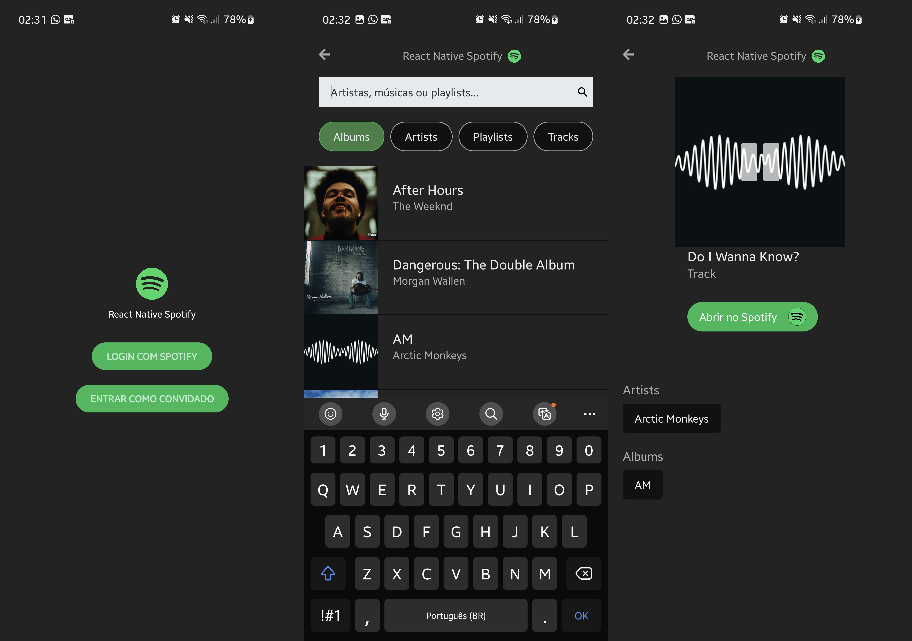

# App utilizando a Api do spotify


-Autenticação de token no modo Guest e também por DEEP LINK schema, na sua própria conta do Spotify
-Player de música e filtro categorias na busca




## Prerequisitos


Utilize algum instalador de pacotes como yarn ou npm para escrever os comandos a seguir no cmd


## Instalação

Abra a pasta raiz do projeto no cmd e digite: 

```
yarn install
```
```
yarn start
```

#### Feito a partir de:
- React Native
